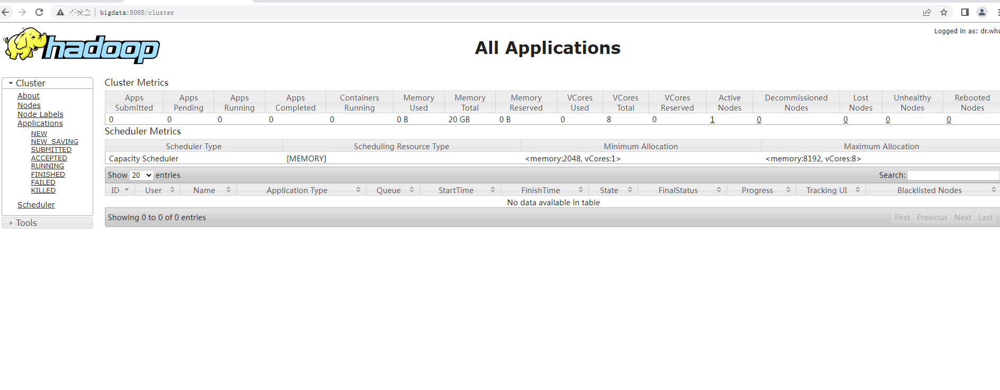

## 计算机毕业设计Hadoop+Spark抖音可视化 抖音视频情感分析 抖音舆情监测 预测算法 抖音爬虫 抖音大数据 情感分析 NLP 自然语言处理 Hive 机器学习 深度学习

## 要求
### 源码有偿！一套(论文 PPT 源码+sql脚本+教程)

### 
### 加好友前帮忙start一下，并备注github有偿Hadoop抖音分析25
### 我的QQ号是2827724252或者798059319或者 1679232425或者微信:bysj2023nb 或bysj1688

# 

### 加qq好友说明（被部分 网友整得心力交瘁）：
    1.加好友务必按照格式备注
    2.避免浪费各自的时间！
    3.当“客服”不容易，repo 主是体面人，不爆粗，性格好，文明人。

​	
## 功能
数据分析Spark、数据库Hive MySQL、服务器djano、爬虫requests
技术栈：数据分析Spark、数据库Hive MySQL、服务器djano、爬虫requests

jieba库
中文分词，通俗来说，就是将一句(段)话按一定的规则(算法)拆分成词语、成语、单个文字。 中文分词是很多应用技术的前置技术，如搜索引擎、机器翻译、词性标注、相似度分析等，都是先对文本信息分词处理，再用分词结果来搜索、翻译、对比等。
情感分析
snownlp库
snownlp 是一个用于处理中文文本的 Python 库，它提供了各种功能来帮助用户执行包括情感分析、词性标注、文本翻译、文本相似度计算、文本摘要、文本分词等多个自然语言处理任务。我们通过他对我们分词的情感进行评估。
snownlp 提供了情感分析功能，通过 sentiment 方法可以对文本的情感倾向进行评估。它返回一个最大为1分为（负面情感）、（正面情感）之间的数值。
词云图
def get_img(数据库字段名，蒙版图片，结果图片)
连接数据库获取字段数据

通过jieba库获取词组
中文分词，通俗来说，就是将一句(段)话按一定的规则(算法)拆分成词语、成语、单个文字。 中文分词是很多应用技术的前置技术，如搜索引擎、机器翻译、词性标注、相似度分析等，都是先对文本信息分词处理，再用分词结果来搜索、翻译、对比等。

生成词云图

Plt绘制词云图

机器学习
简介
机器学习是一门多领域交叉学科，涉及概率论、统计学等多门学科。它专门研究计算机怎样模拟或实现人类的学习行为，以获取新的知识或技能，重新组织已有的知识结构，从而不断改善自身的性能。机器学习是人工智能的核心，是使计算机具有智能的根本途径，其应用遍及人工智能的各个领域。

机器学习是一种能够赋予机器学习的能力以此让他们能够完成直接编程，无法完成的方法，从实践来说，就是一种利用数据，训练出模型，然后使用模型预测的一种方法。

线性回归算法
线性回归算法是一种用来预测连续数值的监督学习算法。
线性回归假设存在一个线性关系，即一条直线或者一条高维空间内的超平面，能够最好地拟合输入变量和输出变量之间的关系。换句话说，它试图找到一个最佳的线性方程来描述数据之间的关联。
sklearn.linear_model.LinearRegression 是 Scikit-learn 库中用于实现线性回归算法的类，用于训练线性回归模型。

## 演示视频
https://www.bilibili.com/video/BV1Ez421i7bF/?spm_id_from=333.999.0.0

## 演示截图

